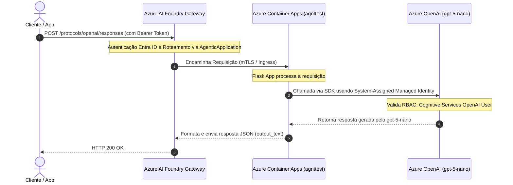

Markdown

# 🤖 Hosted Agent on Azure AI Foundry & Azure Container Apps

Este repositório contém a arquitetura, o código-fonte e os scripts de automação para a implantação de um **Custom Hosted Agent** (Python/Flask) no **Azure Container Apps**, integrado nativamente ao **Azure AI Foundry Gateway**.

A solução processa requisições de inferência consumindo o modelo `gpt-5-nano` via **System-Assigned Managed Identity** (autenticação *passwordless* com a role `Cognitive Services OpenAI User`), garantindo aderência aos princípios de Zero Trust e eliminando o uso de chaves de API estáticas.

---

## 🏛️ Arquitetura da Solução

🛠️ Tecnologias Utilizadas

    Linguagens e Frameworks: Python 3.10, Flask

    SDKs de IA: azure-ai-projects, azure-identity

    Nuvem & Infraestrutura: Azure Container Apps, Azure Container Registry (ACR), Azure AI Foundry

    Segurança: Azure RBAC, System-Assigned Managed Identity, Microsoft Entra ID

    Automação: Azure CLI, PowerShell

📋 Pré-requisitos

Antes de iniciar a implantação, certifique-se de possuir:

    Conta Azure Ativa: Com permissões para criar e gerenciar recursos (Contributor ou Owner).

    Azure CLI (v2.60+): Instalada e autenticada (az login).

    Docker Desktop: Em execução para build e envio da imagem.

    Recursos Provisionados no Azure:

        Projeto e recurso no Azure AI Foundry com o modelo gpt-5-nano implantado.

        Azure Container Registry (ACR) configurado.

    PowerShell 7+ ou Bash: Para execução das rotinas de deployment.

⚡ Como Implantar
1. Conteinerização e Envio ao Registry (ACR)
PowerShell

# Build da imagem Docker
docker build -t 9e9bcccedufilho436512iaa5abacr.azurecr.io/agnttest:v1 .

# Login no ACR e Push
az acr login --name 9e9bcccedufilho436512iaa5abacr
docker push 9e9bcccedufilho436512iaa5abacr.azurecr.io/agnttest:v1

2. Provisionamento do Azure Container App
PowerShell

# Habilitar usuário admin no ACR e obter credenciais
az acr update -n 9e9bcccedufilho436512iaa5abacr --admin-enabled true
$acrPassword = (az acr credential show -n 9e9bcccedufilho436512iaa5abacr --query "passwords[0].value" -o tsv)

# Criar Ambiente e App no Container Apps
az containerapp env create `
  --name edufilho43-6512-ia-env `
  --resource-group DefaultResourceGroup-WUS `
  --location westus

az containerapp create `
  --name agnttest `
  --resource-group DefaultResourceGroup-WUS `
  --environment edufilho43-6512-ia-env `
  --image 9e9bcccedufilho436512iaa5abacr.azurecr.io/agnttest:v1 `
  --target-port 8000 `
  --ingress external `
  --registry-server 9e9bcccedufilho436512iaa5abacr.azurecr.io `
  --registry-username 9e9bcccedufilho436512iaa5abacr `
  --registry-password $acrPassword

3. Configuração de Segurança (Managed Identity & RBAC)
PowerShell

# Habilitar Managed Identity no Container App
az containerapp identity assign `
  --name agnttest `
  --resource-group DefaultResourceGroup-WUS `
  --system-assigned

# Atribuir a Role RBAC para acesso ao Azure AI
$principalId = (az containerapp show --name agnttest --resource-group DefaultResourceGroup-WUS --query "identity.principalId" -o tsv)
$resourceId = (az cognitiveservices account show --name edufilho43-6512-ia-resource --resource-group DefaultResourceGroup-WUS --query "id" -o tsv)

az role assignment create `
  --assignee $principalId `
  --role "Cognitive Services OpenAI User" `
  --scope $resourceId

4. Registro no Control Plane do Azure AI Foundry

Crie o arquivo payload.json na raiz do projeto:
JSON

{
  "properties": {
    "kind": "CustomContainer",
    "agents": [
      {
        "name": "agnttest",
        "properties": {
          "containerAppResourceId": "/subscriptions/<SUA_SUBSCRIPTION_ID>/resourceGroups/DefaultResourceGroup-WUS/providers/Microsoft.App/containerApps/agnttest"
        }
      }
    ]
  }
}

Registre o recurso AgenticApplication via Azure REST API:
PowerShell

$subId = (az account show --query "id" -o tsv)

az rest --method put `
  --url "[https://management.azure.com/subscriptions/$subId/resourceGroups/DefaultResourceGroup-WUS/providers/Microsoft.CognitiveServices/accounts/edufilho43-6512-ia-resource/projects/edufilho43-6512-ia/applications/agnttest?api-version=2026-05-15-preview](https://management.azure.com/subscriptions/$subId/resourceGroups/DefaultResourceGroup-WUS/providers/Microsoft.CognitiveServices/accounts/edufilho43-6512-ia-resource/projects/edufilho43-6512-ia/applications/agnttest?api-version=2026-05-15-preview)" `
  --body '@payload.json'

🧪 Teste de Integração (Gateway)

Para validar a chamada fim-a-fim através do ponto de extremidade unificado do Azure AI Foundry Gateway:
PowerShell

# Obter token Entra ID do usuário chamador
$token = (az account get-access-token --resource [https://ai.azure.com](https://ai.azure.com) --query accessToken -o tsv)

# Disparar requisição POST
Invoke-RestMethod -Uri "[https://edufilho43-6512-ia-resource.services.ai.azure.com/api/projects/edufilho43-6512-ia/applications/agnttest/protocols/openai/responses?api-version=2026-05-15-preview](https://edufilho43-6512-ia-resource.services.ai.azure.com/api/projects/edufilho43-6512-ia/applications/agnttest/protocols/openai/responses?api-version=2026-05-15-preview)" `
  -Method POST `
  -Headers @{
    "Authorization" = "Bearer $token"
    "Content-Type"  = "application/json"
  } `
  -Body '{"input":"Say hello"}'

Exemplo de Resposta (HTTP 200 OK):
JSON

{
  "output_text": "Hello! Nice to meet you. How can I help today?"
}

🔒 Considerações Operacionais & Produção

    Autenticação & Permissões: Caso receba erro 403 Forbidden, certifique-se de que a identidade chamadora possui a atribuição de função adequada no escopo da aplicação do agente no Foundry.

    Gerenciamento de Estado: Os endpoints de aplicação operam de forma stateless. O histórico de conversas em interações de múltiplos turnos deve ser mantido no cliente.

    Ciclo de Vida de Publicação: Atualizações no container mantêm o mesmo FQDN e endpoint no Gateway, garantindo zero-downtime e transparência para integrações existentes.
